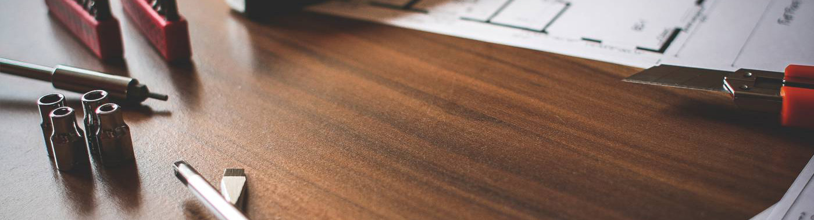
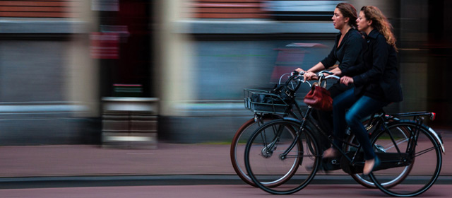
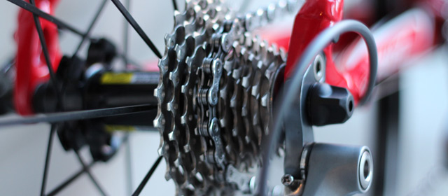
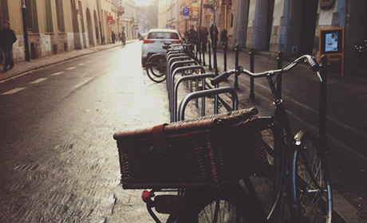
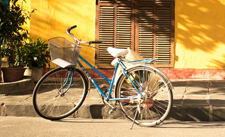
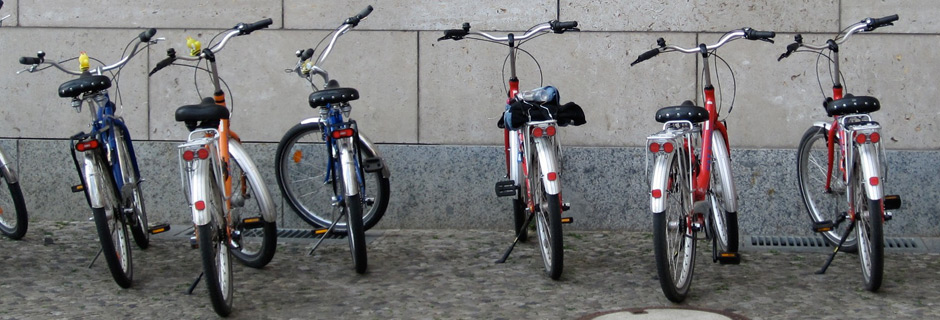

<div align="center">

# 🚲 Bikcraft — Bicicletas Feitas à Mão


<br>

**Site institucional de bicicletas artesanais personalizadas, feitas à mão no Rio de Janeiro.**

Cada Bikcraft é única, desenhada para quem valoriza o detalhe, o conforto e a beleza das coisas feitas com as mãos.

<br>

[](https://developer.mozilla.org/pt-BR/docs/Web/HTML)
[](https://developer.mozilla.org/pt-BR/docs/Web/CSS)
[](https://developer.mozilla.org/pt-BR/docs/Web/JavaScript)
[](https://sass-lang.com/)
[](https://www.php.net/)
[](https://vercel.com/)

</div>

---

## 📸 Screenshots

<div align="center">

### 🏠 Página Inicial


### 🚴 Produtos



### 📂 Portfólio



### 👥 Equipe


</div>

---

## ✨ Funcionalidades

- 🎨 **Design System "Terra & Craft"** — Estética orgânica com paleta de tons terrosos (Cream, Copper, Olive, Sage)
- 📱 **Design Responsivo** — Mobile-first com breakpoints em 480px, 768px e 960px
- 🎬 **Animações on Scroll** — Reveal animations suaves via Intersection Observer
- 🎠 **Sliders/Carrosséis** — Depoimentos e galeria com autoplay e navegação por dots
- 📝 **Formulários Seguros** — Validação HTML5, honeypot anti-spam, sanitização no backend PHP
- 🔒 **Headers de Segurança** — X-Content-Type-Options, X-Frame-Options, Referrer-Policy
- 🧊 **Header com Glassmorphism** — Efeito backdrop-filter ao rolar a página
- 📲 **Menu Mobile Fullscreen** — Hamburger menu animado com controle de acessibilidade
- 🖋️ **Tipografia Premium** — Google Fonts: Fraunces (serif display) + Outfit (sans-serif body)
- ♿ **Acessibilidade** — ARIA labels, roles semânticos, `focus-visible`, `sr-only`
- 📧 **Envio de E-mails** — Backend PHP com PHPMailer via SMTP/SSL
- ⚡ **Zero Dependências JS** — JavaScript vanilla ES6+ sem frameworks

---

## 🛠️ Tecnologias

<div align="center">

| Tecnologia | Descrição |
|:---:|---|
|  | Estrutura semântica com ARIA labels |
|  | Custom Properties, CSS Grid, Flexbox, animações |
|  | ES6+: Intersection Observer, Fetch API, sliders vanilla |
|  | Pré-processador CSS (arquivos legados do curso) |
|  | Backend para formulários via PHPMailer |
|  | Fraunces + Outfit |
|  | Hospedagem e deploy automático |

</div>

---

## 📁 Estrutura do Projeto

```
bikeCraft-Origamid/
├── 📄 index.html          # Página inicial (hero, produtos, portfólio, qualidade)
├── 📄 produtos.html       # Detalhes dos 3 modelos + formulário de orçamento
├── 📄 sobre.html          # História, missão, valores e equipe
├── 📄 portfolio.html      # Depoimentos + galeria de fotos
├── 📄 contato.html        # Formulário de contato + mapa + dados
├── 📄 enviar.php          # Backend de processamento dos formulários
├── 📄 vercel.json         # Configuração de deploy na Vercel
│
├── 📂 css/
│   ├── style.css          # CSS principal — Design System "Terra & Craft"
│   └── scss/              # Arquivos SASS originais (legado)
│
├── 📂 js/
│   ├── main.js            # JavaScript vanilla ES6+
│   ├── plugins.js         # Plugins legados (não utilizado)
│   └── libs/              # jQuery e Modernizr legados (não utilizados)
│
└── 📂 img/
    ├── produtos/          # Fotos e ícones dos modelos
    ├── portfolio/         # Fotos do portfólio
    └── redes-sociais/     # Ícones de redes sociais
```

---

## 🚀 Como Usar

### 📋 Pré-requisitos

- Navegador moderno (Chrome, Firefox, Edge, Safari)
- [PHP 7.4+](https://www.php.net/) *(opcional — apenas para formulários)*
- [Git](https://git-scm.com/) *(para clonar o repositório)*

### 📥 Clonando o Repositório

```bash
git clone https://github.com/dev-erickydias/bikeCraft-Origamid.git
cd bikeCraft-Origamid
```

### ▶️ Rodando o Projeto

#### 🟢 Opção 1 — Servidor PHP (completo)
```bash
php -S localhost:8000
```
> Acesse: http://localhost:8000

#### 🟡 Opção 2 — Python
```bash
python -m http.server 3000
```
> Acesse: http://localhost:3000

#### 🟠 Opção 3 — Node.js
```bash
npx serve -l 5000
```
> Acesse: http://localhost:5000

#### 🔵 Opção 4 — Direto no Navegador
Basta abrir o arquivo `index.html` diretamente no navegador.

> ⚠️ **Nota:** Os formulários de contato/orçamento só funcionam com o servidor PHP + PHPMailer configurado.

---

## ⚙️ Configuração dos Formulários

Para que os formulários enviem e-mails, edite o arquivo `enviar.php`:

```php
$email_envio = 'seu@email.com';         // E-mail receptor
$email_pass  = 'sua-senha-app';         // App password do Gmail
$site_url    = 'https://seusite.com';   // URL do site
```

📦 Requer a biblioteca [PHPMailer](https://github.com/PHPMailer/PHPMailer) no diretório `./PHPMailer/`.

---

## 🎨 Paleta de Cores

| Cor | Hex | Uso |
|---|---|---|
| 🟫 Cream | `#faf5eb` | Background principal |
| 🟤 Copper | `#b8734a` | Acentos, botões, destaques |
| 🟢 Olive | `#1e2e1e` | Backgrounds escuros, contraste |
| 🌿 Sage | `#6b8f71` | Elementos secundários |
| ⬛ Charcoal | `#2a2a2a` | Texto principal |

---

## 📜 Licença

Este projeto é para **fins educacionais**, baseado no curso da [Origamid](https://www.origamid.com/).

Sinta-se livre para usar como referência de estudo! 📚

---

## 👤 Autor

<div align="center">

**Ericky Dias**

[](https://github.com/dev-erickydias)

</div>

---

## 🙏 Créditos

- 🎓 **Projeto original**: Curso [Origamid](https://www.origamid.com/)
- 📷 **Fotos**: [Unsplash](https://unsplash.com) (licença gratuita)
- 🔤 **Fontes**: [Google Fonts](https://fonts.google.com) — Fraunces + Outfit

---

<div align="center">

Feito com ❤️ por [Ericky Dias](https://github.com/dev-erickydias)

⭐ Se este projeto te ajudou, deixe uma estrela!

</div>
